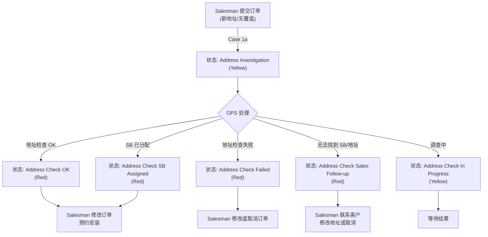
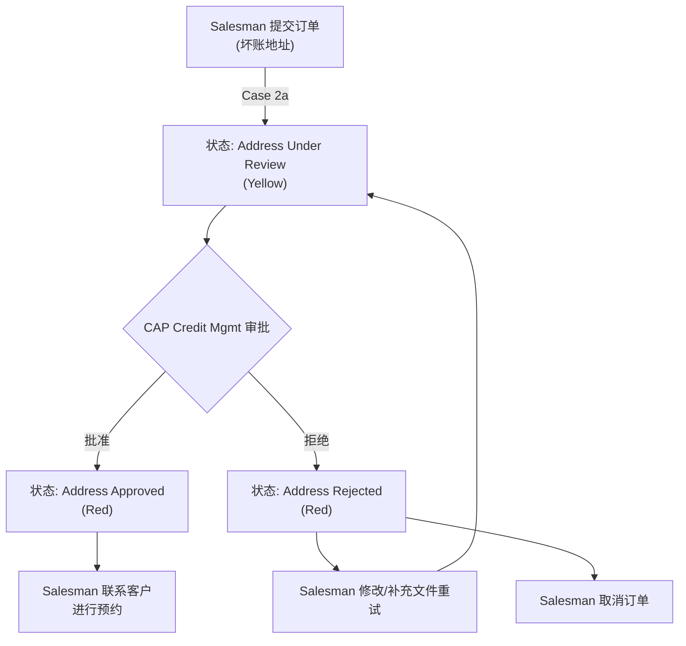
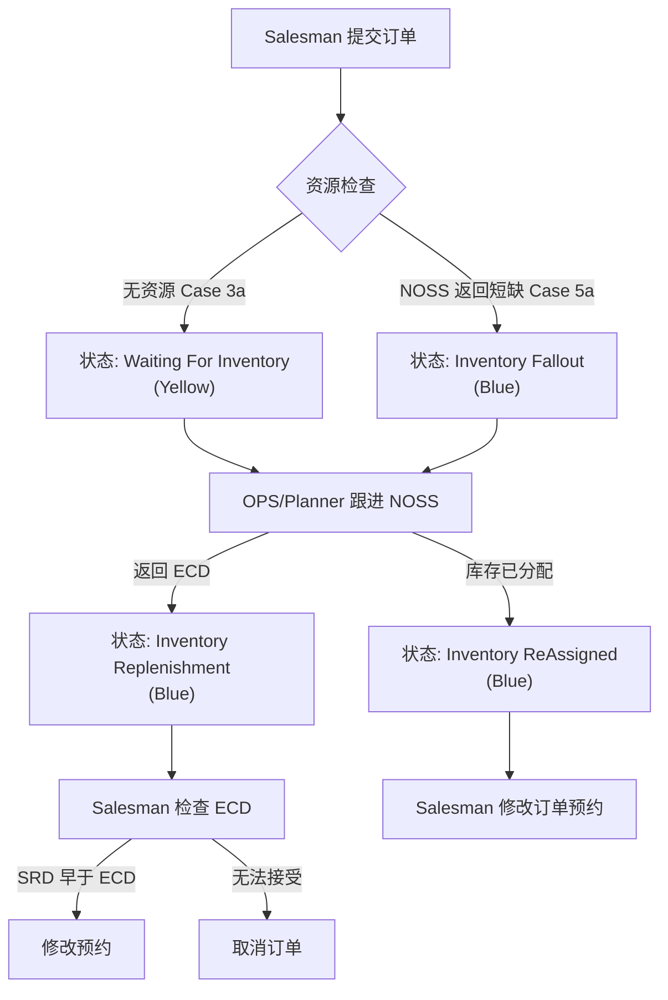
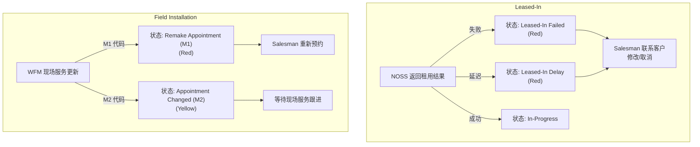

# LTS 订单 Fallout 案例总结

本文档总结了 LTS 订单处理过程中的各种 Fallout (异常/中断) 场景、触发条件、状态变更及后续处理动作。

## 1. 案例汇总表格

| Case# | 场景 (Scenario) | 触发源 (Trigger From) | 履行状态 (Fulfilment Status) | 关注度 (Attention) | 后续行动 (Follow-up Action) |
| :--- | :--- | :--- | :--- | :--- | :--- |
| **1. 地址覆盖问题 (No Address Coverage)** | | | | | |
| 1a | 提交新地址订单 (无 SB#) | COM (Salesman) | Address Investigation | Yellow | 订单显示在 Pending 列表；OPS 线下通知结果；Salesman 修改或取消订单。 |
| 1b | NOSS 返回地址检查 OK | NOSS | Address Check OK | Red | Salesman 检查备注中的新地址，修改订单预约安装或取消。 |
| 1c | NOSS 返回地址检查失败 | NOSS | Address Check Failed | Red | Salesman 检查 OPS 备注，修改订单或取消。 |
| 1d | OPS 无法找到 SB 或地址 | OPS | Address Check Sales Follow-up | Red | Salesman 联系客户修改安装地址或取消订单。 |
| 1e | OPS 更新地址调查状态 (SB Assigned) | OPS | Address Check SB Assigned | Red | Salesman 检查备注中的新地址，修改订单预约安装或取消。 |
| 55 | OPS 更新地址调查状态 (In Progress) | OPS | Address Check In Progress | Yellow | Salesman 等待 OPS 地址检查结果。 |
| **2. 坏账地址问题 (Bad Payment Address)** | | | | | |
| 2a | 提交坏账地址订单 | COM (Salesman) | Address Under Review | Yellow | 订单显示在 CAP Pending 列表；CAP Credit Mgmt 审批/拒绝。 |
| 2b | CAP 批准订单 | COM (CAP Team) | Address Approved | Red | Salesman 检查备注，联系客户并修改订单进行预约。 |
| 2d | CAP 拒绝订单 | COM (CAP Team) | Address Rejected | Red | Salesman 检查备注，修改订单/上传文件重试，或联系客户取消。 |
| **3. 地址资源短缺 (Address Resource Shortage)** | | | | | |
| 3a | 提交订单时无资源 (Spare Avail=N) | COM (Salesman) | Waiting For Inventory | Yellow | OPS/Planner 跟进 NOSS 资源，通过 NORA 通知前线 ECD (预计完成日期)。 |
| 3b | NOSS 返回 ECD 和备注 | NOSS | Inventory Replenishment | Blue | Salesman 检查 ECD，如果 SRD 早于 ECD 则修改订单预约，或取消。 |
| **4. PIPB 号码无库存 (PIPB No DN Inventory)** | | | | | |
| 4a | 提交订单时 DN 无库存 | COM (System) | Number Investigation | Yellow | 订单显示在 F&S Pending 列表；CRM 等待 F&S 确认 DN 库存就绪。 |
| 4b | F&S 标记 DN 库存就绪 | COM (F&S) | In-Progress | - | 订单自动提交。 |
| **5. 库存 Fallout (Inventory Fallout)** | | | | | |
| 5a/11a | 提交订单后 NOSS 返回资源短缺 | COM (Salesman) -> NOSS | Inventory Fallout | Blue | OPS/Planner 跟进，通知 ECD。 |
| 5b/11b | NOSS 返回 ECD (资源补充) | NOSS | Inventory Replenishment | Blue | Salesman 检查 ECD，修改订单预约或取消。 |
| 5d/11d | NOSS 返回库存已分配 | NOSS | Inventory ReAssigned | Blue | Salesman 修改订单进行预约。 |
| **6. 租用线路 Fallout (Leased-In Fallout)** | | | | | |
| 6b | NOSS 返回租用失败 | NOSS | Leased-In Failed | Red | Salesman 检查备注，联系客户修改或取消。 |
| 6c | NOSS 返回租用延迟 | NOSS | Leased-In Delay | Red | Salesman 检查备注，联系客户修改或取消。 |
| 6d | NOSS 返回租用成功 | NOSS | In-Progress | - | Salesman 检查备注。 |
| **7. 现场安装 Fallout (Field Installation Fallout)** | | | | | |
| 7a | 现场服务更新预约 (M1) | WFM | Remake Appointment (M1) | Red | Salesman 跟进，使用相同的 Appointment ID 重新预约。 |
| 7c | 现场服务更新预约 (M2) | WFM | Appointment Changed (M2) | Yellow | 等待现场服务跟进 (可能转为 M1)。 |
| **8-10. 其他 (Others)** | | | | | |
| 8 | 携号转网拒绝 (Porting Reject) | COM (2N Team) | Porting Rejected | Red | Salesman 修改/取消订单并重新提交。 |
| 9 | 紧急取消 (Urgent Cancellation) | COM (Carrier Team) | Porting Urgent Cancelled | Red | Salesman 修改/取消订单并重新提交。 |
| 10 | 携号转网接受 (需重约) | Carrier Team | Porting Accepted (Appointment Remake) | Red | Salesman 需注意红灯警示并修改 SRD。 |

---

## 2. 业务流程图

### 2.1 地址覆盖与调查流程 (Address Coverage)

### 2.2 坏账地址审批流程 (Bad Payment Address)

### 2.3 库存与资源 Fallout 流程 (Inventory Fallout)

### 2.4 租用线路与现场安装 Fallout (Leased-In & Field Installation)

